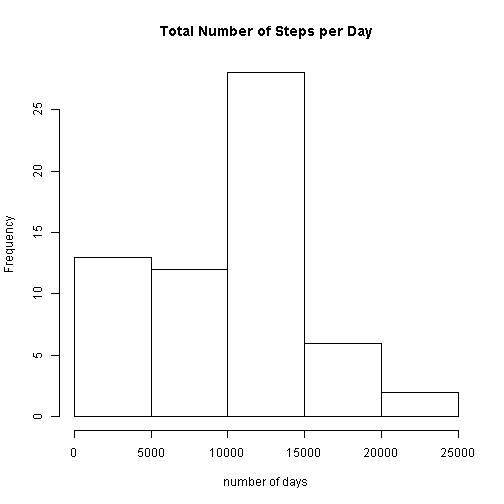
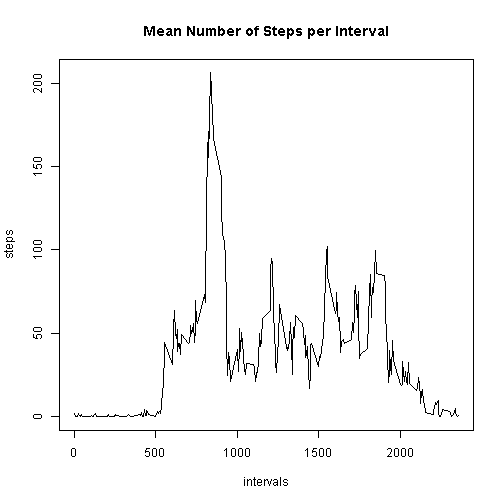
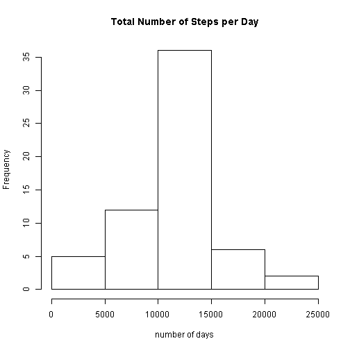

## The Data
The assignment is based on the Activity monitoring dataset, which is avalable via [the course web site](https://d396qusza40orc.cloudfront.net/repdata%2Fdata%2Factivity.zip). The data is stored in the csv format and consists of 17,568 observations of the following variables:  
* steps: number of steps taken in a five-minute ineterval  
* date: measurment date in format YYYY-MM-DD  
* interval: identifier for the five-minute measurerment interval  

## Loading and preprocessing the data
The dataset is stored in a zip archieve in the assignment repository. In this report we assume that the R working directory is set to the local assignment repo, and no separate file download rutine is needed.  
Additionally, we transform the `date` column from class `character` to class `Date` for future analysis. 

```r
temp <- unzip("activity.zip",list=FALSE)
ACT <- read.csv(temp,header=TRUE,nrows=17568,stringsAsFactors=FALSE)
ACT$date <- as.Date(ACT$date,format="%Y-%m-%d")
```
## Calculating mean total numbers of steps per day
First we look at the total number of steps taken in each day.

```r
tot_steps <- tapply(ACT$steps,ACT$date,sum,na.rm=TRUE)
hist(tot_steps,main="Total Number of Steps per Day",xlab="number of days")
```

 

Now we calculate the mean and the median total number of steps taken per day:

```r
mean_steps <- mean(tot_steps)
med_steps <- median(tot_steps)
```
The mean, rounded to one decimal point, is 9354.2, and the median is 10395.

## Determining the daily activity pattern
We now look at the mean numbers of steps taken in each five-minute interval.

```r
mean_int_steps <- tapply(ACT$steps,ACT$interval,mean,na.rm=TRUE)
plot(as.integer(names(mean_int_steps)),mean_int_steps,type="l",xlab="intervals",ylab="steps",
        main="Mean Number of Steps per Interval")
```

 

Obtained results suggest that, on average, the maximum number of step is taken within the 835 interval.

## Imputing missing values
The `steps` column of the dataset contains 2304 missing values, encoded as `NA`. As missing values can affect the analysis of the data, we fill them in with the average number of steps for the respective five-minute intervals.

```r
na_steps <- which(is.na(ACT$steps))
ACT_mod <- ACT
int <- as.integer(names(mean_int_steps))
for (i in 1:length(int)){
      a <- which(ACT$interval[na_steps]==int[i]) 
      if (length(a)>0) ACT_mod$steps[na_steps[a]] <- mean_int_steps[i]
}        
```
The histogram of the total number of steps per day now has notably less heavy left tails:

```r
tot_steps_mod <- tapply(ACT_mod$steps,ACT_mod$date,sum,na.rm=TRUE)
hist(tot_steps_mod,main="Total Number of Steps per Day",xlab="number of days")
```

 

There is also a change in the mean and the median total numbers of steps per day:

```r
mean(tot_steps_mod)
```

```
## [1] 10766.19
```

```r
median(tot_steps_mod)
```

```
## [1] 10766.19
```
As can be seen, filling in the missing data increased both the mean and the average total number of steps per day, and brought the distribution of the variable closer to normal by making the two measures of central tendency equal.  

## Determining the differences in activity patterns between weekdays and weekends
We add a new column to the dataset, indicating whether the measurment was taken on a weekday or weekend.

```r
wkd <- rep(NA,nrow(ACT))
wkd[weekdays(ACT$date) %in% c("Saturday","Sunday")] <- "weekend"
wkd[is.na(wkd)] <- "weekday"
ACT_mod <- cbind(ACT_mod,as.factor(wkd))
colnames(ACT_mod)[ncol(ACT_mod)] <- "day"
```
To get the first glimpse at possible differences between the number of steps taken during weekdays and weekends, we make a panel plot of the number of steps taken in each five-minute interval, averaged across all weekdays and all weekends:

```r
n_int = length(mean_int_steps)
A <- data.frame(interval=rep(as.integer(names(mean_int_steps))),
                avg=numeric(2*n_int),
                day=rep(c("weekday","weekend"),each=n_int))
A$avg[1:n_int] = tapply(ACT_mod$steps[ACT_mod$day=="weekday"],
                        ACT$interval[ACT_mod$day=="weekday"], mean,na.rm=TRUE)
A$avg[(n_int+1):(2*n_int)] = tapply(ACT_mod$steps[ACT_mod$day=="weekend"],
                        ACT$interval[ACT_mod$day=="weekend"], mean,na.rm=TRUE)
library(lattice)
xyplot(avg~interval | day,data=A,type="l",xlab="Interval",ylab="Number of steps",
       layout=c(1,2))
```

 
